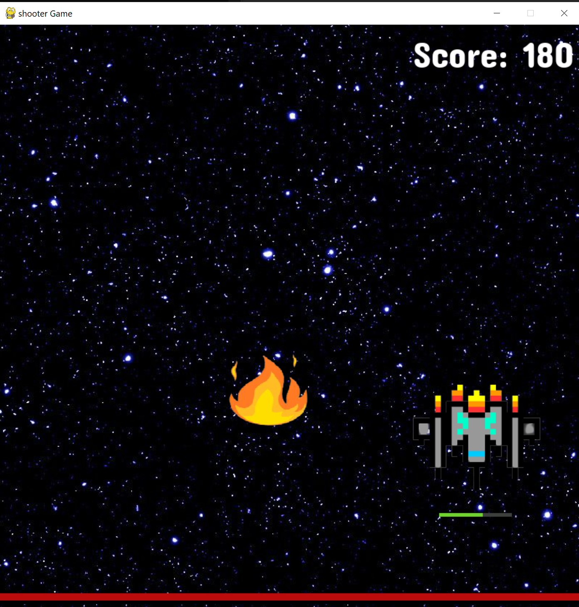

# Editor_pygame

## Interface
notre jeu détient les caractéristiques suivante:

- détient une interface menu au démarage du jeu
- un boutton pour initier une partie
- un module "mixer" qui permet la gestion des sonorités du jeu
- un score est affiché tout au long de la partie
- un système de tire de proprojectile

## Le menu

Voici l'inetrface du menu

## La partie

une partie dans notre jeu est décomposé en deux phases:

- la phase astéroides
- la phase comètes

Voici la phase astéroides:

Voici la phase comètes:

## Conclusion
Le jeu que nous avons créé est le fruit de nombreuses heures de travail et de recherche, et le résultat cherché a été obtenu:
nous avons fait un programme qui remplit l'ensemble des critères d'un jeu vidéo.
